# Data Engineering Fundamentals



Ten chapters. Every concept is a live simulator you break on purpose.

The watermark simulator shows what happens when your event-time window is set two minutes
too short: late events disappear silently and you have no way to see what you lost.
The backfill simulator shows what happens when a retry hits a non-idempotent write:
row counts double, quietly, in production.

This is not a Spark tutorial. It will not show you how to configure Airflow or write
a Kafka producer. It teaches why those tools are designed the way they are,
and what happens when they fail.

---

## Try it

```
https://www.timloehr.me/data-engineering-fundamentals/
```

Or locally, no install required:

```bash
git clone https://github.com/Mavengence/data-engineering-fundamentals.git
cd data-engineering-fundamentals
python3 .serve.py
# http://127.0.0.1:5002
```

`index.html` also works if you open it directly in Chrome.

---

## Ten chapters

| # | Chapter | The lesson |
|---|---------|-----------|
| 00 | Core Fundamentals | Why columnar skips 99% of disk reads. What Parquet actually is. |
| 01 | Ingest | Two clocks per event. The wrong one decides what you lose. |
| 02 | Streaming | Fast loses on completeness; slow loses on latency. Pick one. |
| 03 | Store | One bad day on Day 3 poisons every day that follows it. |
| 04 | Compute | The planner bets on statistics. Wrong stats, wrong plan. |
| 05 | Orchestrate | A task that ran twice must equal a task that ran once. Non-negotiable. |
| 06 | Quality | A bad row is worse than a missing row. The bad one ships to the exec deck. |
| 07 | Discover | Six commands. The answer in under 3 seconds. Always. |
| 08 | Serve | Five teams. Five DAU numbers. One meeting. |
| 09 | Govern | An unannotated PII column never ships. |
| 10 | Capstone | Break any one of six contracts. Watch exactly what fails downstream. |

---

## Five simulators worth running first

### Column scanner

Flip the toggle from row-oriented to columnar. Ninety-nine columns drop to near-invisible;
the target column lights up blue. The progress bar crosses the table in a fraction of the time.
You understand projection pushdown before you read the label.

### Hash-join shuffle

Drag the key skew slider to 90%. Worker 0 overflows with a pulsing OVERLOADED indicator
while the other workers dim out, nearly idle. The hot-key problem stops being abstract.

### Idempotent backfill

Flip `INSERT OVERWRITE` to `INSERT`. Introduce a simulated task failure. Watch the retry
append a second copy of every row. Flip back, re-run: the overwrite makes it irrelevant.

### Watermark drag

Drag the event-time window. Events on the late side turn amber and drop as the window closes.
You are moving the cutoff by hand and watching the data loss happen in real time.

### Guided Capstone tutorial

Hit the guided tutorial button. In 48 seconds, each of the six contracts breaks in sequence:
rows burst at the gate, stats go wrong, the downstream number changes. Then everything resets.

Ten more simulators are in the course.

---

## How it works

Vanilla React 18 via CDN, Babel standalone, plain CSS. No bundler, no `npm install`.
One `index.html` loads chapter files from `src/chapters/`. Fork it. Teach with it.

```
data-engineering-fundamentals/
├── index.html              entry point
├── styles.css              all styles
├── lib/theme-tokens.css    design tokens
├── src/chapters/           one JSX file per chapter
│   ├── App.jsx             sidebar + routing
│   ├── shared.jsx          shared components
│   ├── Ch_Overview.jsx     animated pipeline overview
│   ├── Ch0_Fundamentals.jsx
│   ├── Ch0_StackSims.jsx   LayerCake, ByteTrace, SqlDecoder, ConnectorSwitcher
│   └── Ch1_Ingest.jsx ... Ch9_Capstone.jsx
└── .serve.py               no-cache dev server
```

---

## License

MIT

[](LICENSE)
